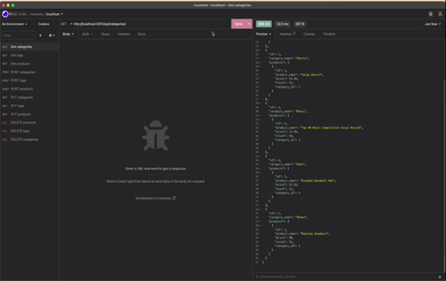

# E-Commerce-Back-End

## Description
The E-Commerce-Back-End application takes a working Express.js API and configures it to use Sequelize to interact with a MySQL database.

## Table of Contents

- [Installation](#installation)
- [Usage](#usage)
- [License](#license)
- [Credits](#credits)
- [Refrences](#refrences)

## Installation
User will clone the repository. After cloning, run "npm install" to install the necessary packages. This application requires `node`, `express`, and `sequelize`,

## Usage
To run the app, type `node server.js`, `npm run watch` or `npm start` into the command-line. Users will be given prompts to make changes to the database.

* GET routes to return all categories, products, and tags

* GET routes to return a single category, product, and tag

* POST routes for categories, products, and tags 

* PUT routes for categories, products, and tags 

* DELETE routes for categories, products, and tags 

View demo video [HERE](https://watch.screencastify.com/v/a6zJJzYb0cXhgiOdkYFP)

## License
This application is licensed under MIT.

For detailed information about this license, go to https://mit-license.org/.

## Credits
This project was completed through the University of Minesota Coding Bootcamp

## Refrences
* [Sequelize Associations](https://sequelize.org/docs/v6/core-concepts/assocs/) 
